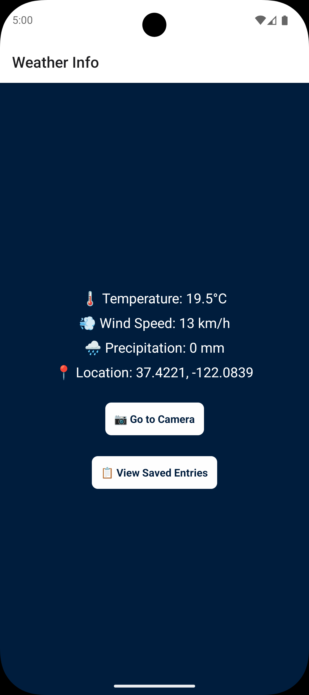
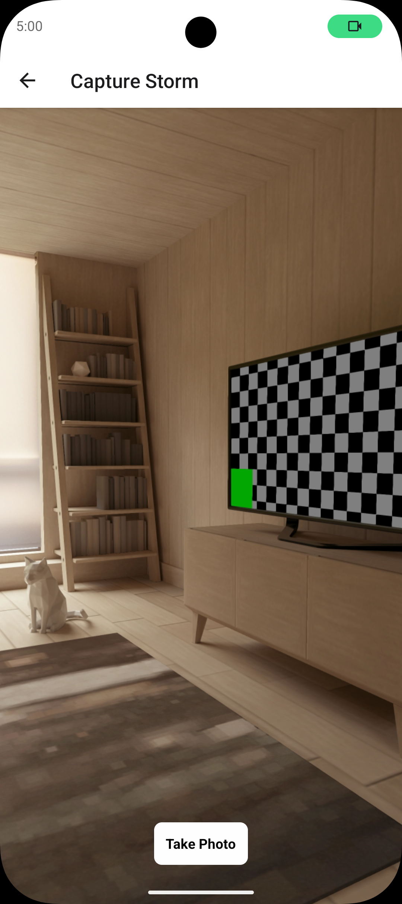
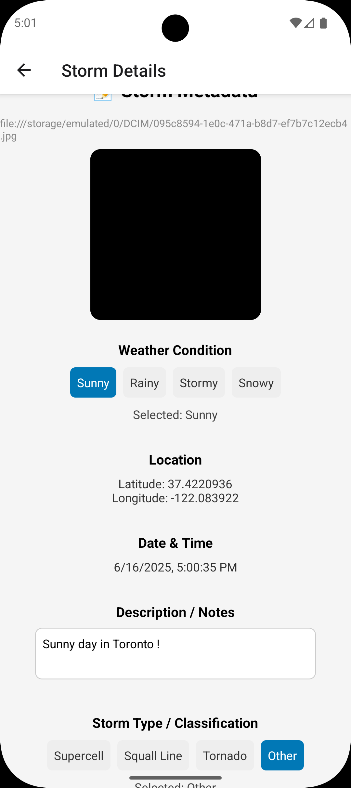
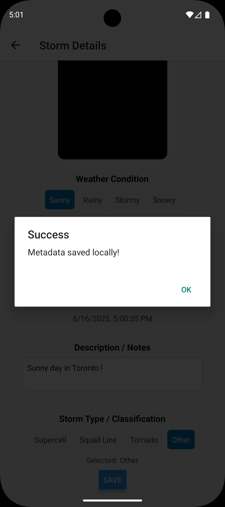
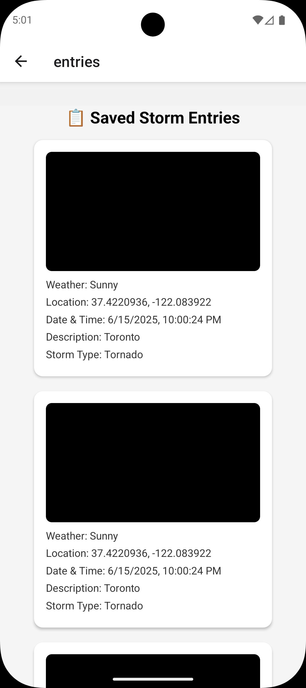

## Storm Chaser App

A React Native app for documenting and classifying storm events with photo, weather, location, and notes.  
This project was built as a portfolio/demo app to showcase mobile development skills, including API integration, local storage, and multi-screen navigation.

---

## Features

- 📸 Take and save storm photos with metadata
- 🌦️ Weather API integration (Open-Meteo)
- 📍 Automatic location capture
- 📝 Add notes and classify storm type
- 💾 Local data persistence (AsyncStorage)
- 📋 View and manage saved entries

---

## Tech Stack

- React Native (Expo)
- AsyncStorage
- Expo Location & Camera
- Open-Meteo API

---

## Screenshots


<<<<<<< HEAD
**Weather Info**  


**Capture Storm**  


**Storm Details**  


**Success Popup**  


**Saved Entries**  


---
=======


>>>>>>> 20d9229f202d9d0ddf00756b6e549296cfdfd04a

## Try Instantly

Scan the QR code below with [Expo Go](https://expo.dev/client) to try the app on your device:


---

## Get Started

1. **Install dependencies**
    ```bash
    npm install
    ```
2. **Start the app**
    ```bash
    npx expo start
    ```

You’ll find options to open the app in:
- [development build](https://docs.expo.dev/develop/development-builds/introduction/)
- [Android emulator](https://docs.expo.dev/workflow/android-studio-emulator/)
- [iOS simulator](https://docs.expo.dev/workflow/ios-simulator/)
- [Expo Go](https://expo.dev/go), a limited sandbox for trying out app development with Expo

You can start developing by editing the files inside the **app** directory. This project uses [file-based routing](https://docs.expo.dev/router/introduction/).

---

## Get a Fresh Project

When you're ready, run:

```bash
npm run reset-project